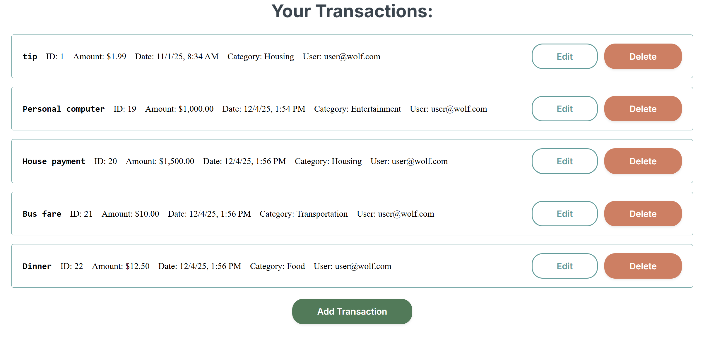
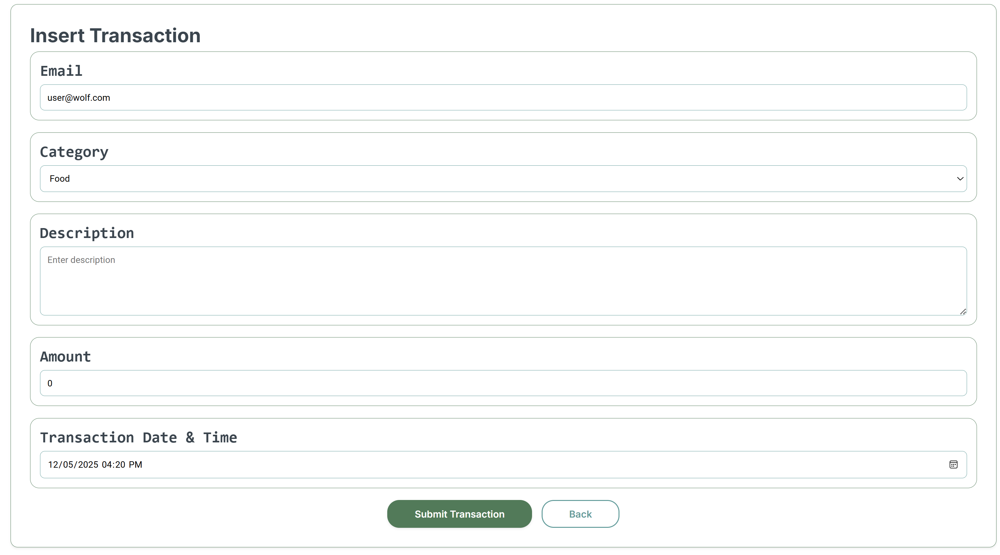

# Wolf of Wright Street - UI Group Repository
This is the UI repository for the Transaction Tracker project. 
- Our main repository can be found [here](https://github.com/WSU-kduncan/cs4900-wolf-of-wright-street).
- Our API repository can be found [here](https://github.com/WSU-kduncan/cs4900-api-wolf-of-wright-street).
### Group Members
- Kyle Cox
- Daniel Cronauer
- Samuel Kondall
- Cyrus Straley

### Project Features
- Transaction list, which allows users to view, create, edit, or delete Transactions, establishing GET/PUT/POST/DELETE requests from the API and Database
- A page for adding or editing transaction inforamation, which does not accept invalid information

### Future Work
- Filtering system for transactions for users, users and categories, etc. etc. - currently it just shows every existing transaction (all of these required GET requests are present on the API side)
- Budgeting system (implemented on the API side already, just not here)
- Some cleaner implemenatation to increase security, this is primarily a proof-of-concept UI

## Running the Application
### Required Tools
To run the UI portion of this project, the following tools are required:
- Node 24.11.0 (`node --version`): Javascript utilized for running the project.
- npm 11.6.1 (`npm --version`): Package manager, works with Node, installed packages and puts them into a `package.json` file. 
- Angular-CLI 20.3.8 (`ng v`): A web application framework of which this project is built upon.
- Many other dependencies which can be found in our [package.json](wolf-budget-ui-app/package.json) file.
- Additionally, there are required dependencies for running the database (Docker container) and API (Java SpringBoot) which will be detailed in their respective repositories.

### Other Repositories
This application can be run in a standalone fashion, but nothing related to database/API connections will function properly. The following steps must be done before attempting to compile this project if actual interaction with the database wants to be obtained:
1. Running Docker container for the DBeaver database - clone the main repository, run `docker compose up` within [this folder](https://github.com/WSU-kduncan/cs4900-wolf-of-wright-street/tree/main/DATABASE/DBeaver_Docker_Integration) locally. (instructions included at this link)
2. Clone the [API Repository](https://github.com/WSU-kduncan/cs4900-api-wolf-of-wright-street) separately, and run `./gradlew bootRun` in the newly created folder. Verify that the API runs correctly and throws no errors in the console log. *Make sure the Docker container is running before you do this - otherwise, it WILL NOT start!*

### Compiling UI
Follow these steps in order to run the UI:
- Clone this repository using `git clone <URL>`, and run `cd wolf-budget-ui-app` to get to the proper folder.
- Install all required dependencies listed in `package.json` using `npm install`.
- Run the application using `ng serve`.
- If no errors occur on the above step, you should be able to connect to `localhost:4200` on a browser within your system to access the page.

## Project Screenshot Examples
#### Transaction Page
Transaction page, where you can add/edit/remove transactions:

#### Transaction Add & Edit Page
Page to fill in information for adding and editing transactions:

